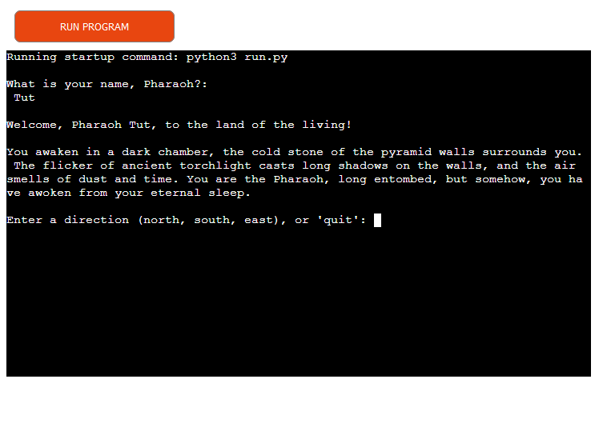
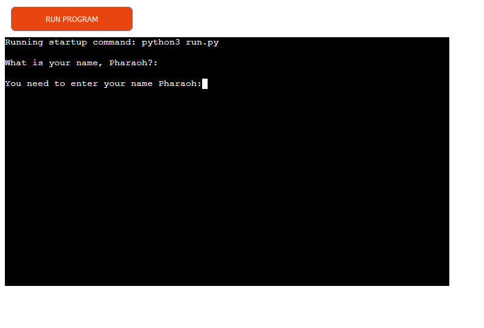
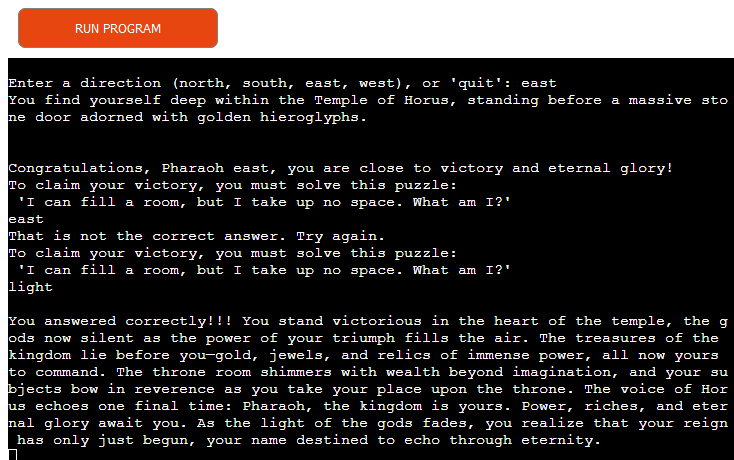
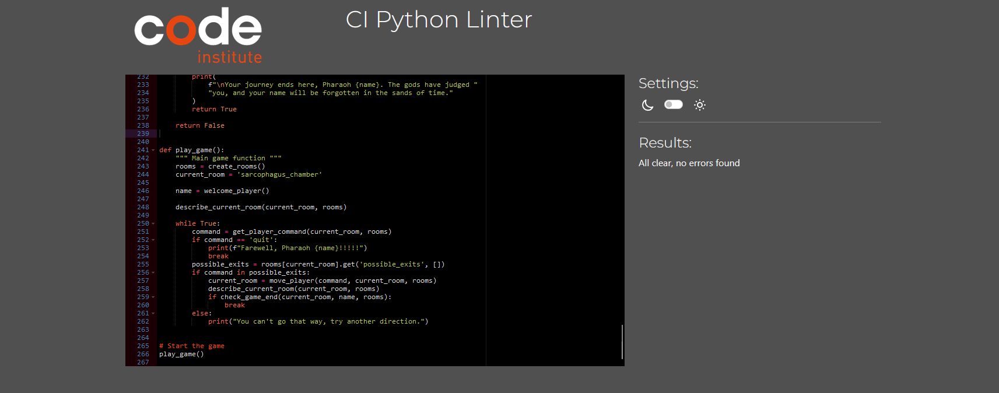
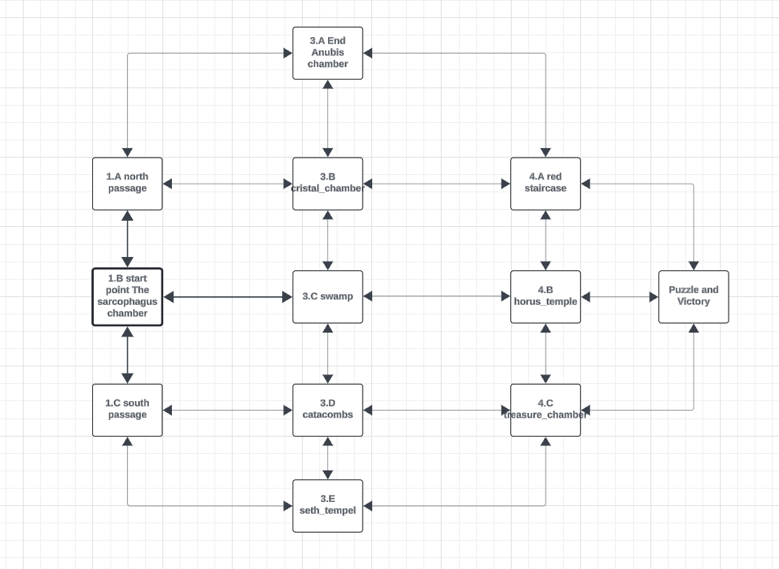

# Piramid Aventure 

### A text-base Adventure Game

Piramid Aventure is a text-based adventure game where you, the Pharaoh, have 
mysteriously awoken from your eternal slumber in an ancient pyramid. As you 
explore various chambers, your choices will determine your fate. Can you 
reclaim your glory, or will the gods seal your fate forever?

---

## Table of Contents

- [Overview](#overview)
- [How to Play](#how-to-play)
- [Features](#features)
    - [Existing Features](#existing-features)
    - [Future Features](#future-features)
- [bugs and Errors](#bugs-and-erros)
- [Testing](#testing)
- [Flowchart](#flowchart)
- [Deployment](#deployment)
- [Tools](#tools)
- [Acknowledgements](#acknowledgements)

---

## Overview
In **Piramid Aventure**, players explore a series of interconnected rooms
within an ancient pyramid. The goal is to navigate through the various
chambers, solve puzzles, and make wise choices to either reclaim your throne
or face eternal doom. Each room holds its own story, and each step you take
will bring you closer to either glory or downfall.

The fully deployed project can be accesed at 
[Piramid Aventure](https://piramid-aventure-6e77b696f9e3.herokuapp.com/)

---
## How to Play
1. Upon launching the game, you'll be asked to provide your name as the Pharaoh.
2. After the welcome message, you will awaken in the Sarcophagus Chamber.
3. Navigate the pyramid using directional commands: north, south, east, west
   depending on available exits from your current room.
4. Type commands based on the prompts to explore rooms, interact with
   the environment, and solve puzzles.
5. The game ends when you either:
   - Solve the final puzzle and claim victory.
   - Meet your demise in one of the dangerous chambers like the Seth
     Temple or Anubis Chamber.

## Features

### Existing Features

The game has multiple features implemented  to make the experience more 
interactive and enjoyable.
- **Personalize your Text-based Adventure**: The game ask as input the name 
of the player at the beginning, **"What is your name, Pharaoh?"** so the user 
can put the name of their choosing for the whole game.

- The the code also protect from accidental empty 
spaces or estarting without name, If the player leaves the input blank 
(presses Enter without typing anything), the function will keep asking for a 
valid name by displaying: **"You need to enter your name Pharaoh:"**. 
Once a valid name is provided, the player is greeted with a personalized 
message: **"Welcome, Pharaoh [name], to the land of the living!"**, and same 
name is returned to be used throughout the game.

- **Text-based Adventure**: Explore rooms, interact with the environment, 
and make choices via text commands.
- the text comands available are North, South, East, West, and Quit.
-every room gives the user the choices availables for each room, they change 
depending of the room, making it easier for the user to know where to go.
- **Puzzle Solving**: the game gives the user the challenge at the end to 
answer a puzzle to unlock paths claim victory.

- **Multiple Endings**: Your journey can end in different ways based on the 
decisions of the paths that you make.
- **Rich Storytelling**: Experience a story filled with ancient Egyptian 
mythology and aventure.

### Future Features

- **Inventory System**: Players will be able to collect items during their 
 exploration. when all items gather the last room will apear.
- **Secret Ending**: If the player does not input any commands for 30 seconds 
at the first room, a hidden "secret winning ending" is triggered,
- **Monster Battle System**: The player may encounter monsters,  Players will 
have to fight using random numbers for health and attack.
- **Randomized Puzzles**: To enhance replayability, puzzles will be randomized 
for each playthrough. This means that even if a player plays multiple times, 
they will encounter different challenges, keeping the game fresh and engaging.

---

## Bugs and Errors

#### Refactoring: From One Big Function to Many Independent Functions:
- Initially, the project had a **single large function** that handled all 
 aspects of the game: greeting the player, handling room descriptions, 
 and moving between rooms, game-end, and puzzles. While this approach worked,
 it led to several major problems:
- **Complexity**: The function became difficult to read, maintain, and debug.
- **Testing**: It was nearly impossible to test individual components of the 
game logic without running the entire function.
- **Scalability**: As more features were added, the function grew more 
complicated, making it harder to manage and extend.

**The Solution**:
- To address these issues, the code was refactored into 
**many independent functions**, each responsible for a single task. 
This new structure improved the code in several ways:

- **Modularity**: Each function now handles a specific task, such as 
welcoming the player `welcome_player()`, moving between rooms `move_player()`, 
or describing the current room `describe_current_room()`.
- **Readability**: The code became cleaner and easier to understand. Each 
function's purpose is clearly defined.
- **Reusability**: Functions can now be reused and modified independently. 
- **Testability**: Individual functions can now be tested separated.
- **Future Features**: New features will  be added as standalone functions, 
without needing to modify the whole program.

---

## Testing

### CI Python Linter test
thanks to the CI Python Linter test, the program got clean and up to date with
format.

### Manual Test
**Player Name Input**
- **Goal**: Ensure player cannot proceed without entering a valid name.
- **Steps**:
  1. Run the game.
  2. Leave the name input blank and press Enter.
  3. Enter a valid name (e.g., "Tutankhamun").
- **Expected Result**: Game ask again until a valid name is entered, 
then displays a personalized welcome message.

**Room Navigation**
- **Goal**: Verify room descriptions and valid/invalid movement.
- **Steps**:
  1. Start in `sarcophagus_chamber` and enter directions: `north`, `south`, 
  `east`,  `west`.
  2. move to every single room in every possible direcction , valid or 
  invalid direction.
- **Expected Result**: Room descriptions appear, valid exits work, and 
invalid moves are denied.

**Puzzle Victory**
- **Goal**: Correct puzzle-solving leads to victory.
- **Steps**:
  1. Reach the `Victory_chamber Room`.
  2. Solve the puzzle by typing "light."
- **Expected Result**: Displays victory message and ends the game.

**Game Over Condition**
- **Goal**: Verify that certain rooms end the game.
- **Steps**:
  1. Enter the `Anubis Chamber` or `Seth Temple`.
- **Expected Result**: The game ends with a "Game Over" message. 

---

## Flowchart

The Flowchart for my program was created using <b>LucidChart</b> and it
a visually repesentation of how all the rooms are connected. it was a big help 

 

---

## Deployment

- This project was deployed using Heroku:
- Create a new Heroku app
- Add two buildpacks from the "Settings" tab in that order:
   - Python
   - NodeJS
- Add Config Vars from the "Settings" tab:
- Key: PORT
- Value: 8000
- Connect your GitHub repository and deploy as normal
- choose 

---

## Tools

- [GitHub](https://github.com/) - used for hosting the source 
  code of the program
- [Gitpod Dev Environment](https://gitpod.io/) - used for testing the program.
- [CI Python Linter](https://pep8ci.herokuapp.com/) - 
  used for validating the python code.
- [Heroku](https://dashboard.heroku.com/) - used for deploying the project.
- [LucidChart](https://www.lucidchart.com/) - used for creating the Flowchart.

---

## Acknowledgments

I would like to express my  gratitude to the following people who 
contributed to the success of this project:

- **Fellow students**: For their support, feedback, and encouragement 
   throughout the development process.
- **Mentor Spencer**: For providing guidance, mentorship, and inspiration, 
   which helped me navigate through challenges and stay on course.
- **All the Tutors**: For their dedication, patience, and expert advice, 
necessary skills to complete this project.
**My Son**: For the idea of making a game of ancient Egypt, big ideas for 
some of the rooms.

Thank you all for your contributions to this game.